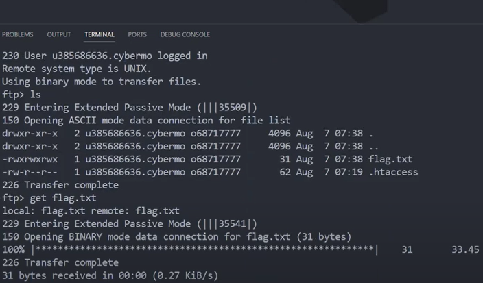

# Python_script
Creation of a python script to decrypt a public and private key and capture a flag.

## Guidelines
Our team intercepted some data in transit and got 2 files. One of these files is readable but the other one is very strange looking. Try to see if you can understand something from it and extract the information. The investigation team says it can be used to get the flag but I don't know how.

File 1 (Strange looking file): 
File 2 (Readable file): 

After researching and understanding the concept of public and private key for encryption and decryption and how a key is generated with each variable, it was easier to craft a script to decrypt the strange file that has hexadecimal value.

Explanation of key generation:
values: 
1) p and q which are both prime
2) n= p*q
3) phiN= (p-1)*(q-1)
4) integer e
5) gcd(phiN,e)= 1; 1 < e < phiN
6) d = e^-1 mod phiN
7) Public key = {e,N}
8) Private key = {d,n}

The goal was to find a "p" and "q" as the "n" was given and both "p" and "q" are unsafe prime which means that those variable can be found as the multiplication of "p" and "q" is supposed to give "n".
## Script number 1

---------------------------------------------------------------------------------------------------
import math
import sympy

def pollard(n):

    a = 2

    i = 2

    while(True):
        
        #a = (a**i) % n
        a = pow(a,i,n)

        d = math.gcd((a-1), n)

        if (d > 1):

            return d
        
            break
        i += 1

# Driver code
n = 0xa09d5bbe7b77137e4a923e89057edaac71a600b229ad43bd20e56b5aa2e2ddd4a1171322d4af4fa8f48437a7663917f726b225964df20a37df79210694a081f5f28199e35997f52dfcaa5c7b9971b00b02acf2fc2fead62ed0bbc6fd5c275fb5d72ead7fe5b82b9818717acf77d6108fef8a56c5a2307866f8779d336a8f44d0cb8699f4c2db98564fed93e863f48778f802cc9d32b7185cd76a47fec3b056e804a26b4d1b254f055e73ffc08a547ad4bede1d297876140665ae93f04cacb6f88665797d6e48a9ba3d1500f16067adfb5624199e73ccd806c283a399e25b8cc223575112353b3ed24939f98dc33e0ac5298b690995ffcc5ce66d7e9ef976a801
# temporarily storing n
num = n

# list for storing prime factors
ans = []
while (True):

    d = pollard (num)
    ans.append(d)

    # r = int(num/d)
    r = num//d

    if(sympy.isprime(r)):

        ans.append(r)
        
        break
    else:

        num = r

# print the result
print("Prime factors of", n, "are", *ans)

---------------------------------------------------------------------------------------------------

Once the prime factors were found, I had to do another script with the actual formula to get the public and private key.

## Script number 2:

---------------------------------------------------------------------------------------------------
from sympy import invert

n = 20275725101473426999610084123020248290129213926585084438752915204909581424818836798673019110617556014803726965616338885453492666351217215034931790256712756086561821632690687205196237137887228270928509776194528276136684350927672479580167472118982603182912850770807723377902174289662158049033927156727452430230013153698667105803226656736552135913318475343399101814434226788644339297838517639643195185914616827198056693934557514165978081656301990789103328835595780784126740096138982740676641953850405587535290337004397973547242480930369322199503040459329186640740198978689871723598586177026481471318777599135524282869761

p = 125134920897549739255174050341300713003231661235612680264588621981385509131151600441745010195461041895934604306296201492565968578872268838578738413968550730995589164636193457091841895757037495023347713684830455177226592265814480360704148656189916226253157503713016954411923066833839400357410487044937109498707

q = 162030909965360796242343215135512737840926678817313914224913003548743640643247949784642193150161095933868767005955222826671030639705063451935787818921075449976527699144993027602615001124674355917780757694012526167683482071075831309533193962594992252249357997031610675138835102793281746914804337797305703778523

phiN = (p-1) * (q-1)

c = 0x3bdc793f35515b9a380af7b3a5962731420cb80ad230e6d3f1114443716140eb14b63697946fabe7eee3bb4b0e25cd1dabdc7cb7767e75093df84cad60c0315a4edc3a56bf8227e1886551329c8487ebe7cbb9fdc8fbe33e4366364775ed64c52bde18e2cab249d0728681d67ad47c4309cfaf91eac45879cc8f1910261b3b281fb8028b2a8f728fde5d3a844fdf2ee7c86bcfb9c7f2b71752bd8196f8c295de773a2fee341603ce24e7150bed130250b22dc445f9cc743be1f8d8e558d48dd40e3bc4096dc0dd0643f8feb3d26d0e05ee8c2b45b082fdc77931dc6350f6f2b2c29a1122ec3f7f9ae715625c5a637b3397705e596b4c1913c10b21f569323308

e = 0x10001

d = int(invert(e, phiN))

M = pow(c,d,n)

M = hex(M)

M = M[2:]

M = bytes.fromhex(M)

print(M)

---------------------------------------------------------------------------------------------------

The second script gave me a username and a target to attack.
After that, I looked up the protocol of the target that were open using nmap and noticed that the ftp protocol port was open.
I then used the hydra command to crack the password with the readable file that looked like a password list file to try and connect to the server.

